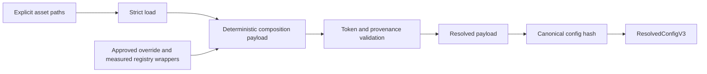

# A0.5 V3 Canonical Composable Layer ADR

**Trạng thái:** `D10-A/D11-A/D12-B/D15-B IMPLEMENTED_CORE_ONLY — D13–D14 PENDING — A0.5.2 YAML MIGRATION BLOCKED — RUNTIME NOT APPROVED`  
**Phạm vi cập nhật:** A0.5.2.4 D11-A/D12-B explicit source selection extension; không tạo/migrate YAML, không grouping/extraction, không thay đổi loader/compiler/hash/composition hay runtime.  
**Trạng thái runtime:** `RUNTIME NOT APPROVED`

## 1. Quyết định và phân loại bằng chứng

### 1.1 Decision statement

Architect/user đã khóa **Phương án B — canonical composable V3 layers**. Mọi
asset V3 tương lai phải có một canonical field shape đã xác định, được caller
chọn bằng các path tường minh và được ghép theo quy tắc tường minh. Không có
hidden conversion, auto-discovery, profile/mode auto-selection, default ngầm,
hoặc fallback sang V1. V1 và V3 tiếp tục song song.

Token chỉ thuộc input trước resolution. Token không được vào
`ResolvedConfigV3`. `deploy_real` vẫn không sẵn sàng cho đến khi các input,
provenance, map/model được phê duyệt, HIL và Gate 4 đều được resolve theo
authority; ADR này không cung cấp bất cứ giá trị nào trong số đó.

| Phân loại | Trạng thái chính xác |
| --- | --- |
| `ARCHITECTURE_TARGET` | Architecture schema 3.0 yêu cầu chuỗi `base → runtime profile → navigation mode → approved experiment override → approved measured registry → validation → immutable ResolvedConfig → config_hash`. D03, D05, D2, D7, TF/localization, GT và map identity vẫn là authority đã khóa. |
| `SOURCE_IMPLEMENTATION` | A0.2/A0.3 đã có strict immutable `ResolvedConfigV3`, compiler năm lớp, token policy, canonical post-resolution hash và validator tĩnh. A0.4 có 15 YAML catalog/skeleton đã cài package, nhưng chính tài liệu A0.4 nói rõ chúng chưa compiler-ready/resolved. |
| `PROPOSED_CONTRACT` | Các quy tắc canonical layer, field authority, hash/provenance và migration trong ADR này. Chúng không được xem là implementation approval cho đến khi Architect/user phê duyệt. |
| `OFFLINE_EVIDENCE` | A0.4.1 ghi nhận pytest/package-build/colcon test offline đã pass ngày 2026-10-01. Evidence đó chứng minh catalog/install/test inclusion, không chứng minh canonical composition hiện có. Không có test/build nào chạy trong A0.5.0. |
| `RUNTIME_EVIDENCE` | Không có. Không chạy ROS, Gazebo, runtime, training hay hardware trong A0.5.0. |

### A0.5.1 structural composition primitive

`A0.5.1 IMPLEMENTED_CORE_ONLY`: chỉ hiện thực phần structural composition thuộc D08/collision semantics: bảy mapping in-memory được caller truyền tường minh theo thứ tự base-side rows 1–7, ownership top-level strict và disjoint leaf merge. Primitive không load file, không discovery, không chọn profile/mode, không resolve token, không tạo `ResolvedConfigV3`, không gọi compiler, không hash/provenance và không authorizes runtime.

`A0.5.1.1 PUBLIC-API/OFFLINE RECONCILIATION`: xác minh ba public symbol được lazy-export chính xác từ `mecanum_nav_rl.config` và thêm regression test package-level.

`A0.5.1.2 DECISIONS APPROVED`: D01–D08 được Architect/User khóa trong §6. A0.5.1 vẫn không migrate YAML. D09-B tại §8 đã được Architect/User khóa. Nó chỉ cho phép lập một prompt implementation riêng cho A0.5.2 canonical YAML migration giới hạn; không có compiler hoặc runtime authorization.

## 2. Invariants không được thay đổi

Các mục sau không phải lựa chọn của ADR và không được đổi bởi migration asset:

- Schema là `3.0`; `ResolvedConfigV3` và model lồng nhau strict, immutable,
  `extra="forbid"`. Nó chỉ nhận config resolved hoàn chỉnh, không nhận token.
- D03 giữ nguyên bốn `RuntimeProfileV3`, bốn `NavigationModeV3`, ma trận
  profile/mode model-owned và `use_sim_time=true` trừ `deploy_real=false`.
- D05 giữ `obs-v3-l72-g3-t3-c3-f32`: 81 `float32` gồm 72 LiDAR sectors, ba
  local-reference, ba measured twist, ba previous final-issued command; action
  là `[vx, vy, wz]` normalized trong `[-1, 1]`.
- D2 command semantics giữ đúng chuỗi: **PPO desired action →
  decoder-accepted action → SafetySupervisor limited/final command →
  FinalTwistPublisher issued command + receipt → measured twist/actual
  motion**. Biên sở hữu receipt và các input D2 chưa được authority chốt không
  được bịa ra trong asset.
- GT isolation giữ nguyên: GT chỉ ở các đường được authority cho phép (bao gồm
  internal simulator/oracle/evaluator); policy, observation encoder,
  synchronizer và primary TF tree không có GT input/reachable object.
- TF/localization giữ `map → odom → base_link → lidar_frame`; chỉ EKF sở hữu
  `odom → base_link`; SLAM chỉ ở MAPPING còn AMCL ở NAV2_BASELINE và
  HYBRID_AI_LOCAL. Không tạo TF authority mới.
- `FinalTwistPublisher` là publisher cuối duy nhất của `/cmd_vel`;
  `SafetySupervisor` là safety authority/final selector-limiter.
- Source-class/provenance giữ fail-closed: simulation baseline không suy ra
  real; measured source cần approved registry wrapper; unresolved
  `TBD_MEASURED`, `TBD_PROJECT_ACCEPTANCE`, `REQUIRED_BUILD_INPUT` không có
  default; `deploy_real` non-ready.
- V1/V3 là boundary song song. V3 caller không được tự dùng V1 khi path V3
  thiếu, sai, hoặc không resolve.

## 3. Canonical asset-layer contract đề xuất

### 3.1 Caller selection và lớp

Caller cung cấp tường minh từng path trong bảng composition order dưới đây,
một path profile, một path mode, và khi áp dụng các wrapper typed
`ApprovedExperimentOverrideV3`/`ApprovedMeasuredRegistryV3` được dựng ngoài
asset catalog. Không có API được phép quét thư mục, chọn profile/mode từ
environment/ROS parameter, chọn asset theo tên mặc định, hoặc thử V1 sau thất
bại V3.

`load_v3_yaml_mapping()` hiện tại chỉ kiểm tra UTF-8, cú pháp YAML với root là
mapping, duplicate key, key type, và trả bản copy. Nó không biết full allowed
field set của resolved config. Vì vậy, không được mô tả loader hiện tại là nơi
tự nó từ chối mọi unknown/extra field. Theo proposal, unknown/extra field phải
fail-closed bởi composition contract/schema được phê duyệt và/hoặc bởi
`ResolvedConfigV3(extra="forbid")` ở validation cuối. Việc chọn chính xác
composition schema là một phần của approval trước implementation.

| Lớp | Bản chất đề xuất | Chủ sở hữu semantic |
| --- | --- | --- |
| Base fragment | Những field schema/project/provenance-static, D05, map identity static không phụ thuộc profile/mode | Base asset, trừ field được token hóa trước resolution |
| Profile fragment | Chỉ profile selection, `use_sim_time`, profile-specific source-class/input requirement | Chỉ asset profile được caller chọn |
| Mode fragment | Chỉ navigation mode và D03/D04/D08/D10 ownership/contract IDs theo mode | Chỉ asset mode được caller chọn |
| Shared contract fragment | `topics_qos`, frames/TF, state estimation, localization, command safety, reward, training, evaluation, acceptance theo canonical model shape | Mỗi field thuộc đúng một named shared fragment và ở base-side order tường minh |
| Privileged external wrapper | Approved experiment override hoặc approved measured registry, cùng approval/registry provenance | Wrapper typed, không phải YAML tự tuyên bố approval |

#### Canonical composition order — proposal

| Thứ tự | Loại fragment | Path/wrapper tường minh do caller cung cấp | Top-level field được sở hữu | Có override? | Xử lý collision |
| --- | --- | --- | --- | --- | --- |
| 1 | Base | `base.yaml` | `schema_version`, `project`, `provenance`, `observation`, `action`, `map_identity` | Không | Leaf trùng: lỗi với canonical path |
| 2 | Shared base-side frames | path `frames_tf` được duyệt | `frames_tf` | Không | Leaf trùng: lỗi với canonical path |
| 3 | Shared base-side topics/QoS | path `topics_qos` canonical được duyệt | `topics_qos` | Không | Leaf trùng: lỗi với canonical path |
| 4 | Shared base-side state/localization | các path canonical được duyệt | `state_estimation`, `localization` | Không | Leaf trùng: lỗi với canonical path |
| 5 | Shared base-side command/reward/training/evaluation/acceptance | các path canonical được duyệt | `command_safety`, `reward`, `training`, `evaluation`, `acceptance` | Không | Leaf trùng: lỗi với canonical path |
| 6 | Runtime profile | một path `profiles/<profile>.yaml` | `runtime.runtime_profile`, `runtime.use_sim_time`, profile-owned pre-resolution inputs | Không | Leaf trùng: lỗi với canonical path |
| 7 | Navigation mode | một path `modes/<mode>.yaml` | `runtime.navigation_mode`, `navigation` | Không | Leaf trùng: lỗi với canonical path |
| 8 | Approved experiment override | một `ApprovedExperimentOverrideV3` | Chỉ exact leaf paths được approval nêu | Có, chỉ approved leaf | Ngoài allowlist: lỗi với canonical path |
| 9 | Approved measured registry | một `ApprovedMeasuredRegistryV3` | Chỉ exact measured/provenance leaf paths được approval nêu | Có, chỉ approved leaf | Ngoài allowlist: lỗi với canonical path |
| 10 | Validation | Không phải asset | Toàn bộ payload composed | Không áp dụng | Token/provenance/schema/semantic failure: lỗi |
| 11 | `ResolvedConfigV3` | Không phải asset | Payload strict đã resolved | Không áp dụng | Thiếu/extra/sai type: lỗi |
| 12 | `config_hash` | Không phải asset | Canonical, non-self-referential resolved identity | Không áp dụng | Không có caller-supplied hash; hash failure: lỗi |

Thứ tự 1–5 là **base-side composition** được đề xuất để shared fragments có
vị trí rõ ràng trước profile/mode. Chúng không có implicit precedence lẫn nhau:
chúng chỉ hợp lệ khi top-level/leaf ownership disjoint. Exact phân rã path cho
hàng 3–5 giữ base-side order D08 đã được khóa và primitive A0.5.1 đã hiện thực; task này không thay đổi primitive.

Proposal target giữ architecture order: `base → runtime profile → navigation
mode → approved experiment override → approved measured registry → validation
→ ResolvedConfigV3 → config_hash`; rows 2–5 chỉ là thành phần base-side được
ghép tường minh, không phải layer có precedence độc lập. D05 đã khóa identity boundary; compiler/hash integration vẫn chưa bắt đầu và ADR không tự thay source hiện tại.

Collision được xác định ở **leaf field**. Hai mapping cha được phép merge khi
chúng đóng góp descendant key không trùng nhau. Duplicate leaf luôn fail-closed
kể cả khi value giống nhau; scalar thay mapping hoặc mapping thay scalar luôn
fail-closed. Override chỉ dành cho approved experiment override hoặc approved
measured registry, và chỉ exact leaf path mà authority/approval cho phép. Error
report phải nêu exact canonical field path gây collision. Không được rename
alias, suy ra field, join topic–QoS bằng convention, thêm default, hoặc convert
token thành value: canonical composition chỉ structural compose và strict
validate. Asset hiện tại không direct canonical shape phải được migrate có chủ
đích sau approval, không được đi qua hidden adapter.

`allowed_navigation_modes` là metadata kiểm toán của catalog, không phải field
trong `RuntimeSelectionV3`. Nếu cần giữ, nó phải nằm trong manifest/catalog
ngoài resolved composition và không được compiler suy diễn thành mode select;
nếu không cần, remove khỏi canonical profile payload. D03 đã khóa đây là catalog metadata ngoài resolved payload và không được auto-select mode.

### 3.2 Bảng chuyển đổi toàn bộ asset hiện tại

| Asset hiện tại | Vai trò canonical đề xuất | Field shape hiện tại | Field shape đích đề xuất | Resolved-model fragment trực tiếp? | Có token? | Wrapper/provenance? | Câu hỏi cần duyệt |
| --- | --- | --- | --- | --- | --- | --- | --- |
| `base.yaml` | Base fragment | schema, project/provenance tokenized, D05, `map_identity.source_root`, map token | Chỉ field khớp `ResolvedConfigV3`; `map_identity` dùng `map_id`, `canonical_manifest_sha256`, `artifact_contract_id`; catalog root ở external selection/provenance contract | Có, sau token resolution | Có, trước resolution | Source manifest/architecture identity cần provenance | `source_root` ở đâu nếu không thuộc `MapIdentityV3`; authority cho `artifact_contract_id` |
| `profiles/sim_train.yaml` | Profile fragment | runtime + `allowed_navigation_modes`; tokenized motion limits | `runtime.runtime_profile`, `use_sim_time`; resolved motion limits chỉ sau approved source | Một phần | Có, trước resolution | SIM baseline identity/provenance | Giữ metadata mode ở catalog nào |
| `profiles/sim_eval.yaml` | Profile fragment | Như sim_train | Như sim_train, D03 không chọn mode ngầm | Một phần | Có, trước resolution | SIM baseline identity/provenance | Cùng câu hỏi metadata |
| `profiles/deploy_sim.yaml` | Profile fragment | runtime + tokenized measured limits | profile/time, measured requirement; final values chỉ từ wrapper | Một phần | Có, trước resolution | `ApprovedMeasuredRegistryV3` bắt buộc khi resolved | Exact profile-layer representation of required registry |
| `profiles/deploy_real.yaml` | Profile fragment non-ready | runtime, measured/build tokens, `required_build_inputs` | profile/time + pre-resolution requirement only; no resolved payload khi còn token | Không, cho đến full resolution | Có | Approved registry, map/model/Gate 4 evidence ngoài asset | Representation của Gate 4/input set không làm thành fake resolved data |
| `modes/local_training.yaml` | Mode fragment | `local_controller_owner`, tokenized `path_planner_owner` | `navigation` có `planner_owner`, `controller_owner`, `path_validity_contract_id`, `local_reference_contract_id`, `goal_type`, `goal_settle_contract_id` | Có, sau all required IDs | Có thể, trước resolution | Contract-ID provenance nếu external | Exact canonical owners/IDs for no planner |
| `modes/mapping.yaml` | Mode fragment | teleop owner, tokenized planner field | Đủ `NavigationContractV3` canonical shape | Có, sau all required IDs | Có thể | Contract-ID provenance nếu external | Exact canonical mapping navigation representation |
| `modes/nav2_baseline.yaml` | Mode fragment | `local_controller_owner`, `path_planner_owner` | Đủ `NavigationContractV3` canonical shape | Có, sau all required IDs | Có thể | Contract-ID provenance nếu external | Exact IDs cho path/local reference/settle |
| `modes/hybrid_ai_local.yaml` | Mode fragment | PPO/Nav2/LocalReference aliases | Đủ `NavigationContractV3` canonical shape, không alias conversion | Có, sau all required IDs | Có thể | Contract-ID provenance nếu external | Exact planner/controller local-reference IDs |
| `topics.yaml` | Shared contract fragment | keyed `topic_contracts`; một số scalar/token | `topics_qos: tuple[TopicQosContractV3, ...]` với name/type/pub/sub/QoS/frame/freshness đầy đủ | Có, khi đầy đủ | Có, trước resolution | Topic/QoS source/contract provenance nếu required | Canonical ordered tuple vs approved keyed canonical representation |
| `qos.yaml` | Shared contract fragment hoặc input cho topics | keyed token objects `qos_contracts` | Không merge ngầm sang topic records; mỗi required QoS ID nằm trong full topic record hoặc explicit approved relation | Chỉ khi hợp nhất tường minh thành model field | Có | QoS contract provenance | Canonical topics/QoS representation và ownership of relation |
| `frames.yaml` | Shared frames/TF fragment | frame names/authorities; map authority token | `FrameTfContractV3` đầy đủ, thêm `ground_truth_isolation_policy_id` | Có, sau resolution | Có thể | TF/GT policy identity provenance nếu external | Exact map-to-odom provider/mode handling |
| `acceptance.yaml` | Shared acceptance fragment | tokenized acceptance IDs/hashes | `AcceptanceContractV3` chỉ sau approved preregistration; tokens remain pre-resolution | Có, sau resolution | Có | Approved acceptance artifact provenance | Boundary final-evaluation/acceptance registry |
| `measurements.yaml` | Catalog pointer/pre-resolution input, không phải wrapper | tokenized `measured_registry` mapping | Không được model như `ApprovedMeasuredRegistryV3`; wrapper được caller dựng từ approved external registry bytes + approval provenance | Không trực tiếp | Có | Bắt buộc external typed wrapper | Measurements/registry boundary và catalog representation |
| `algorithms/ppo.yaml` | Shared training fragment + catalog metadata split | `training` plus extra `observation_action_contract` | `training: TrainingContractV3`; D05 cross-reference không nằm extra resolved payload, đưa vào catalog/contract manifest nếu cần | `training` có; metadata không | Có nếu contract hash chưa resolved | Approved training-contract provenance nếu required | Status/representation của PPO catalog-only metadata |

## 4. Xử lý mismatch bắt buộc

- `allowed_navigation_modes`: không map vào `RuntimeSelectionV3`; chỉ D03 model
  validator xác thực cặp profile/mode caller đã chọn. Metadata catalog, nếu
  giữ, tách ra khỏi resolved payload và không là input auto-selection.
- Navigation aliases (`local_controller_owner`, `path_planner_owner`): không
  được đổi tên khi merge. Mỗi mode phải được migrate thủ công thành đầy đủ sáu
  field của `NavigationContractV3`; owner/ID không có authority phải là token
  pre-resolution hoặc `REQUIRES_ARCHITECT_DECISION`.
- Topics/QoS: không nối `topic_contracts` và `qos_contracts` bằng convention
  hay name inference. Payload final phải biểu diễn strict full
  `TopicQosContractV3` records, với ordering canonical được duyệt.
- `ground_truth_isolation_policy_id`: bắt buộc trong frames/TF canonical
  fragment trước model validation; giá trị ID cụ thể thiếu authority phải được
  resolve bằng approved contract, không bịa literal.
- `artifact_contract_id`: bắt buộc trong map identity final. `source_root` là
  selector/catalog concern, không thay thế artifact identity.
- State estimation, localization, command safety, reward, evaluation và
  acceptance: mỗi section phải tồn tại đúng shape strict của `ResolvedConfigV3`;
  asset thiếu section không được compiler tự bổ sung. Nếu canonical ownership
  chưa có authority: `REQUIRES_ARCHITECT_DECISION`.
- PPO metadata ngoài resolved config: tách `observation_action_contract` khỏi
  resolved payload; nó chỉ được giữ như catalog/manifest metadata được duyệt,
  hoặc bị loại. Không tạo field `extra`.
- `measurements.yaml`: không thể tự trở thành `ApprovedMeasuredRegistryV3`.
  External approved registry và approval evidence phải được caller nạp tường
  minh để dựng wrapper typed; catalog chỉ có thể chứa tokenized pointer trước
  resolution nếu approval quyết định cho phép.

## 5. Hash và provenance boundary đề xuất

Đề xuất có ba identity phân biệt, không trộn lẫn:

1. Mỗi raw asset byte và external artifact/wrapper có thể có SHA-256 riêng cho
   inventory/provenance. Đây **không** là `provenance.config_hash`.
2. Sau strict load và composition, normalized fully resolved payload (không
   token, không runtime timestamp) dùng schema
   `mecanum_nav_rl.resolved_config.v3` hiện có để tạo canonical SHA-256.
3. Compiler chèn digest đó vào `provenance.config_hash` rồi mới construct
   `ResolvedConfigV3`; payload hash luôn loại field hash chính nó, nên không
   self-reference.

Tokenized catalog asset có thể có raw-byte/inventory hash, nhưng không có và
không được gọi là resolved `config_hash`. `ApprovedExperimentOverrideV3` và
`ApprovedMeasuredRegistryV3` phải bind cả values lẫn ID/SHA-256/approval
provenance vào deterministic composition payload trước config hash. Điều này
cần xác định rõ schema serialization của wrapper để config hash phản ánh
identity approval, thay vì chỉ hash final fields trùng nhau.

Không fabricated hash, source manifest, registry ID, approval ID hoặc approval
digest. Exact scope của asset-byte manifest và canonical wrapper serialization
chưa được architecture khóa là `REQUIRES_ARCHITECT_DECISION`.

## 6. Decision lock A0.5.1.2

Các field/ownership dưới đây đã được Architect/User khóa. Khóa shape hoặc ownership không resolve một value, ID, hash, registry, receipt, timing, threshold hay provenance chưa có authority. Những giá trị đó tiếp tục là typed token trước resolution và không được vào `ResolvedConfigV3`.

| ID | Quyết định đã khóa | Field/ownership đã khóa | Value/provenance còn unresolved | Trạng thái |
| --- | --- | --- | --- | --- |
| D01 | Canonical topics/QoS là `topics_qos: tuple[TopicQosContractV3, ...]` direct theo model hiện có; không name-inference/join convention. | `topics_qos` là canonical resolved representation. | Exact topic/QoS/freshness contract records và provenance. | `APPROVED_BY_ARCHITECT_USER` |
| D02 | Navigation dùng đủ shape `NavigationContractV3` hiện có. Owner/contract ID chưa có authority phải là typed token trước resolution, không bịa literal. | `navigation` theo toàn bộ shape model hiện có. | Owner/contract ID chưa có authority. | `APPROVED_BY_ARCHITECT_USER` |
| D03 | `allowed_navigation_modes` và PPO observation/action metadata là catalog metadata ngoài resolved composition payload; không auto-select mode. | Metadata tách resolved payload; D03 model vẫn xác thực explicit profile/mode. | Catalog manifest/identity nếu được tạo ở increment sau. | `APPROVED_BY_ARCHITECT_USER` |
| D04 | `measurements.yaml` chỉ là pre-resolution pointer/token catalog. `ApprovedMeasuredRegistryV3` chỉ dựng từ external registry + approval provenance typed. | Registry wrapper ở external typed boundary, không phải YAML approval claim. | Registry, approval ID/SHA-256 và measured values. | `APPROVED_BY_ARCHITECT_USER` |
| D05 | `provenance.config_hash` chỉ hash normalized fully-resolved payload, non-self-referential. Raw inventory/wrapper identity có provenance/manifest identity riêng, không gọi là config hash. | Resolved config identity và raw/wrapper identity tách biệt. | Raw manifest, wrapper identity và mọi hash/provenance concrete. | `APPROVED_BY_ARCHITECT_USER` |
| D06 | Amendment: giữ nguyên 15 V3 assets hiện có; canonical YAML migration riêng sau sẽ thêm đúng `config/v3/state_localization.yaml` và `config/v3/system_contracts.yaml`. | Target tree là 17 assets; mỗi canonical field vẫn có đúng một semantic authority. | YAML content/model values, token/provenance và package-install change của migration sau. | `APPROVED_BY_ARCHITECT_USER` |
| D07 | D2 receipt thuộc `command_safety` external contract; S2 timing và D6 episode limit là profile-owned unresolved inputs; D10 goal-settle là navigation-mode-owned unresolved input. Không chọn giá trị. | Ownership của các input unresolved theo command safety/profile/mode. | Receipt, timing, episode limit, goal-settle values và provenance. | `APPROVED_BY_ARCHITECT_USER` |
| D08 | Giữ structural base-side order đã được A0.5.1 hiện thực; không thay đổi primitive trong task này. | Thứ tự bảy structural fragments và collision semantics đã hiện thực. | Không có value được resolve bởi primitive. | `APPROVED_BY_ARCHITECT_USER` |

## 7. Migration sequence đã cập nhật

| Increment | Trạng thái và phạm vi | Không được thực hiện |
| --- | --- | --- |
| A0.5.1 | `IMPLEMENTED_CORE_ONLY`: structural in-memory composition primitive. | Không YAML loading, token resolution, model/hash/compiler/runtime. |
| A0.5.1.1 | `PUBLIC-API/OFFLINE RECONCILIATION COMPLETE`: lazy public export và regression offline. | Không thay primitive hoặc runtime boundary. |
| A0.5.1.2 | `DECISIONS APPROVED`: decision lock trong ADR này. | Không source/YAML/test change trong increment này. |
| A0.5.2.2 | `D15-B IMPLEMENTED_CORE_ONLY`: immutable caller-owned selection/path-list contract, lazy public export và offline regression. | Không đọc path, scan/discovery, load YAML, compose, resolve token, hash, compiler, `ResolvedConfigV3` hay runtime. |
| A0.5.2.3 | `D10-A IMPLEMENTED_CORE_ONLY`: raw envelope có đúng `fragment` và `catalog`, lazy public export và offline regression. | Không YAML migration, grouping/extraction, filesystem access, model-shape validation, token resolution, hash, compiler, `ResolvedConfigV3` hay runtime. |
| A0.5.2.4 | `D11-A/D12-B IMPLEMENTED_CORE_ONLY`: caller-owned selection nhận explicit opaque paths cho hai canonical source tương lai. | Không tạo/migrate YAML, kiểm path, scan/discovery, load YAML, compose, resolve token, hash, compiler, `ResolvedConfigV3` hay runtime. D13–D14 vẫn pending. |
| A0.5.2 | **Có thể được lập kế hoạch, nhưng phải có prompt implementation riêng.** Khi được giao, chỉ được limited canonical YAML asset migration tới target 17-asset tree (giữ 15 asset hiện có và thêm đúng hai source D11-A/D12-B) theo D09-B grouping explicit. | Không compiler integration, path discovery, token resolution, hash integration, `ResolvedConfigV3` construction, hoặc runtime. |
| Increment sau A0.5.2 | Chỉ bắt đầu khi có scope/approval riêng. | Không được suy ra từ decision lock này. |

Các invariant D03, D05, D2, GT isolation, TF ownership, `FinalTwistPublisher` là publisher cuối của `/cmd_vel`, SafetySupervisor authority và deploy-real non-ready vẫn giữ nguyên. A0.5.2 không được chọn numeric value hoặc fabricated provenance.

## 8. A0.5-D09 explicit asset-to-fragment grouping contract

**Trạng thái:** `APPROVED_BY_ARCHITECT_USER — OPTION D09-B`.

D09-B đóng gap giữa 15 YAML asset và primitive A0.5.1, vốn nhận đúng bảy mapping fragment được caller truyền tường minh. Bảng này là inventory/contract đã khóa, không phải adapter: không asset nào được rename, join, default, suy ra field hoặc tự bổ sung field thiếu.

### Grouping contract fail-closed đã khóa

- Caller phải truyền tường minh toàn bộ path/selection trong grouping manifest/path-list ở increment sau; không scan thư mục hay auto-discovery.
- Caller chọn đúng một profile và một mode tường minh; D03 chỉ validate pair, không auto-select.
- Grouping chỉ tạo mapping structural cho bảy input đã khóa: `BASE`, `FRAMES`, `TOPICS_QOS`, `STATE_LOCALIZATION`, `SYSTEM_CONTRACTS`, `RUNTIME_PROFILE`, `NAVIGATION_MODE`.
- Chỉ descendant disjoint được merge. Duplicate leaf, scalar↔mapping, ownership sai và override ngoài wrapper approved đều là lỗi fail-closed.
- Grouping không rename field, không join `topic_contracts` với `qos_contracts` bằng convention, không fill default, không resolve token, không construct `ResolvedConfigV3`, không hash và không gọi compiler.
- `measurements.yaml` tiếp tục chỉ là catalog pointer, không phải `ApprovedMeasuredRegistryV3`.

| Asset | Canonical fragment target | Đưa trực tiếp vào primitive A0.5.1? | Lý do chính xác nếu không | Field ownership | Token boundary | Cần asset mới tương lai? | Cần explicit grouping manifest/path list? |
| --- | --- | --- | --- | --- | --- | --- | --- |
| `base.yaml` | `BASE` | Không | Có `map_identity.source_root` ngoài shape model và token unresolved; thiếu `artifact_contract_id`. | `schema_version`, `project`, `provenance`, `observation`, `action`, `map_identity`. | Project/provenance/map inputs pre-resolution. | Có, nếu migration cần tách catalog root hoặc bổ sung canonical artifact contract input. | Có nếu D09-B; caller list phải explicit. |
| `profiles/sim_train.yaml` | `RUNTIME_PROFILE` | Không | `allowed_navigation_modes` là catalog-only D03; motion values là token. | `runtime`, `motion_limits`; profile-owned S2/D6 unresolved inputs theo D07. | `SIM_BASELINE` pre-resolution. | Không bắt buộc ngoài metadata tách explicit. | Có nếu D09-B. |
| `profiles/sim_eval.yaml` | `RUNTIME_PROFILE` | Không | `allowed_navigation_modes` catalog-only; motion values token. | `runtime`, `motion_limits`; profile-owned S2/D6 unresolved inputs. | `SIM_BASELINE` pre-resolution. | Không bắt buộc ngoài metadata tách explicit. | Có nếu D09-B. |
| `profiles/deploy_sim.yaml` | `RUNTIME_PROFILE` | Không | `allowed_navigation_modes` catalog-only; measured values cần external wrapper, không phải resolved fragment. | `runtime`, `motion_limits`; profile-owned S2/D6 unresolved inputs. | `TBD_MEASURED` pre-resolution. | Không bắt buộc ngoài metadata tách explicit. | Có nếu D09-B. |
| `profiles/deploy_real.yaml` | `RUNTIME_PROFILE` | Không | `allowed_navigation_modes` và `required_build_inputs` catalog-only; measured/build token không vào resolved payload. | `runtime`, `motion_limits`; profile-owned S2/D6 unresolved inputs. | `TBD_MEASURED`/`REQUIRED_BUILD_INPUT` pre-resolution; deploy-real non-ready. | Có thể cần catalog metadata tách explicit. | Có nếu D09-B. |
| `modes/local_training.yaml` | `NAVIGATION_MODE` | Không | `navigation` dùng aliases, chưa đủ `NavigationContractV3`. | `runtime.navigation_mode`, `navigation`; D10 mode-owned unresolved input. | Token chỉ pre-resolution. | Có, nếu cần canonical navigation fragment data. | Có nếu D09-B. |
| `modes/mapping.yaml` | `NAVIGATION_MODE` | Không | `navigation` dùng aliases, chưa đủ `NavigationContractV3`. | `runtime.navigation_mode`, `navigation`; D10 mode-owned unresolved input. | Token chỉ pre-resolution. | Có, nếu cần canonical navigation fragment data. | Có nếu D09-B. |
| `modes/nav2_baseline.yaml` | `NAVIGATION_MODE` | Không | `navigation` dùng aliases, chưa đủ `NavigationContractV3`. | `runtime.navigation_mode`, `navigation`; D10 mode-owned unresolved input. | Contract IDs chưa authority là typed token. | Có, nếu cần canonical navigation fragment data. | Có nếu D09-B. |
| `modes/hybrid_ai_local.yaml` | `NAVIGATION_MODE` | Không | `navigation` dùng aliases, chưa đủ `NavigationContractV3`. | `runtime.navigation_mode`, `navigation`; D10 mode-owned unresolved input. | Contract IDs chưa authority là typed token. | Có, nếu cần canonical navigation fragment data. | Có nếu D09-B. |
| `topics.yaml` | `TOPICS_QOS` | Không | Shape `topic_contracts` không phải direct tuple `topics_qos`; không được name-inference/join. | Future `topics_qos` only. | Topic fields còn token pre-resolution. | Có thể không, nếu asset hiện tại được migrate có chủ đích. | Có nếu D09-B; không tự discover. |
| `qos.yaml` | `CATALOG_ONLY` | Không | Shape `qos_contracts` không phải `topics_qos`; không thể tự join `topics.yaml`. | Không resolved top-level ownership độc lập. | QoS token pre-resolution. | Có thể cần canonical topics/QoS asset hoặc explicit catalog metadata. | Có nếu D09-B; phải chỉ rõ không join convention. |
| `frames.yaml` | `FRAMES` | Không | Thiếu `ground_truth_isolation_policy_id`; map authority còn token. | `frames_tf`. | Authority ID token pre-resolution. | Có thể migrate chính asset này, không tự bổ sung field. | Có nếu D09-B. |
| `acceptance.yaml` | `SYSTEM_CONTRACTS` | Không | Chỉ sở hữu `acceptance`; `SYSTEM_CONTRACTS` còn thiếu bốn fields khác. | `acceptance`. | `TBD_PROJECT_ACCEPTANCE` pre-resolution. | Có, cho command safety/reward/evaluation hoặc fragment đã group canonical. | Có nếu D09-B. |
| `measurements.yaml` | `CATALOG_ONLY` | Không | Là pre-resolution pointer, không phải `ApprovedMeasuredRegistryV3` wrapper. | Không có resolved top-level ownership. | Registry/approval token external. | Không phải wrapper asset; external registry/provenance khi authority cung cấp. | Có nếu D09-B; không được coi là wrapper. |
| `algorithms/ppo.yaml` | `SYSTEM_CONTRACTS` | Không | `training` chỉ là một field; `observation_action_contract` là D03 catalog metadata ngoài resolved payload. | `training`; metadata không thuộc resolved ownership. | Contract hash token pre-resolution. | Có, cho command safety/reward/evaluation hoặc fragment đã group canonical. | Có nếu D09-B. |

Gap không được che:

- `SYSTEM_CONTRACTS` có năm top-level fields (`command_safety`, `reward`, `training`, `evaluation`, `acceptance`), trong khi tree hiện có chỉ có `training` và `acceptance`; thiếu command safety, reward và evaluation.
- `STATE_LOCALIZATION` chưa có canonical asset tương ứng.
- `topics.yaml` và `qos.yaml` chưa thể tự join thành `topics_qos`.
- `measurements.yaml` là catalog pointer, không phải wrapper.
- `allowed_navigation_modes`, PPO observation/action metadata và `required_build_inputs` không được lọt vào resolved payload.
- Không asset nào được phép tự bổ sung field thiếu.

### D09 options

| Option | Nội dung | D01–D08/one semantic authority/no hidden adapter | V1/V3 và token fail-closed | Package-install/source impact | Khả năng đi tới compiler sau này |
| --- | --- | --- | --- | --- | --- |
| D09-A | Restructure tree thành đúng bảy composable YAML fragments; catalog metadata tách riêng. | Tương thích D01–D08, rõ one authority và không adapter nếu migration explicit. | Giữ V1/V3 parallel; token chỉ pre-resolution. | Thay đổi tree/install assets; nhiều YAML/source-package metadata impact. | Direct nhất nhưng vượt D06 initial 15-file preservation. |
| D09-B | Giữ 15-file tree, tạo explicit grouping manifest/path-list được caller truyền tường minh; grouping chỉ structural, không rename/default/inference. | Tương thích D01–D08 nếu mapping tường minh và mỗi field một authority. | Giữ V1/V3 parallel; token fail-closed; không discovery. | Cần manifest/path-list và implementation grouping sau approval, nhưng giữ install tree ban đầu. | Có thể tiến tới compiler sau canonical migration; compiler integration vẫn scope riêng. |
| D09-C | Mở rộng A0.5.1 primitive để nhận nhiều fragment hơn; yêu cầu thay đổi D08 và source core. | Không phù hợp D08 đã khóa nếu không approval lại; tăng nguy cơ adapter surface. | Có thể giữ boundary nhưng không được suy ra. | Source core/test change lớn nhất. | Chỉ sau architecture decision mới; không phù hợp increment YAML-only. |

**Decision lock:** Architect/User đã chọn D09-B. 15 asset hiện có được giữ; D06 amendment chỉ cho phép thêm đúng `state_localization.yaml` và `system_contracts.yaml` trong YAML migration riêng sau, tạo target tree 17 assets. Future grouping manifest/path-list phải caller-supplied explicit và chỉ structural. Không có hidden adapter hoặc source change trong A0.5.1.4.

### Approval matrix

`A0.5-D09: APPROVED_BY_ARCHITECT_USER — OPTION D09-B`  
`A0.5-D10: APPROVED_BY_ARCHITECT_USER — OPTION D10-A; CANONICAL ASSET ENVELOPE MODEL IMPLEMENTED_CORE_ONLY BY A0.5.2.3`  
`A0.5-D15: APPROVED_BY_ARCHITECT_USER — OPTION D15-B; CALLER-OWNED IMMUTABLE SELECTION API IMPLEMENTED_CORE_ONLY`  
`A0.5-D11: APPROVED_BY_ARCHITECT_USER — OPTION D11-A; FUTURE SOURCE PATH config/v3/state_localization.yaml LOCKED`  
`A0.5-D12: APPROVED_BY_ARCHITECT_USER — OPTION D12-B; FUTURE SOURCE PATH config/v3/system_contracts.yaml LOCKED`  
`A0.5-D13` đến `A0.5-D14: PENDING_ARCHITECT_USER_APPROVAL`  
`A0.5.2 LIMITED CANONICAL YAML MIGRATION MAY BE PLANNED, BUT MUST HAVE A SEPARATE IMPLEMENTATION PROMPT`

**Kết luận:**

`A0.5.1 IMPLEMENTED_CORE_ONLY`  
`A0.5.1.1 PUBLIC-API/OFFLINE RECONCILIATION COMPLETE`  
`A0.5.1.2 DECISIONS APPROVED`  
`A0.5.1.4 D09-B DECISION LOCKED — DOCUMENTATION ONLY`  
`A0.5.2.2 D15-B EXPLICIT V3 ASSET SELECTION FOUNDATION IMPLEMENTED_CORE_ONLY`  
`A0.5.2.3 D10-A CANONICAL ASSET ENVELOPE FOUNDATION IMPLEMENTED_CORE_ONLY`  
`A0.5.2.4 D11-A/D12-B EXPLICIT SOURCE SELECTION EXTENSION IMPLEMENTED_CORE_ONLY`  
`A0.5.2 YAML MIGRATION BLOCKED PENDING D13–D14`  
`A0.5.2 LIMITED CANONICAL YAML MIGRATION MAY BE PLANNED, BUT MUST HAVE A SEPARATE IMPLEMENTATION PROMPT`  
`RUNTIME NOT APPROVED`
